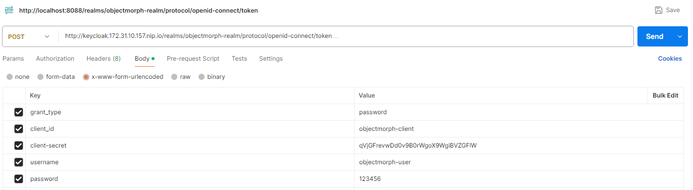
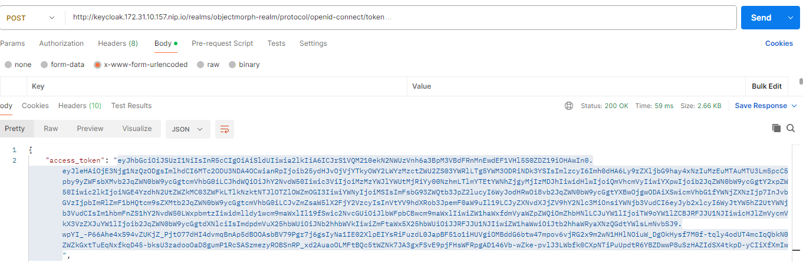

# ObjectMorph-k8s

# Introduction

[ObjectMorph](https://github.com/mohamed-ennahdi/objectmorph) is an application that can be used without any security restrictions. However, **ObjectMorph-K8S** role is to provide a secured interface for ObjectMorph application, without affecting the latter.

# ObjectMorph Authentication Module

Adopting microservices architecture, the goal is to keep ObjectMorph runnable independently, and have the ObjectMorph-k8s run in front of ObjectMorph and require a bearer token, so that ObjectMorph-k8s use Feign Client (spring cloud) to call ObjectMorph endpoints.

# Kubernetes Enabled ObjectMorph

## Local Version

For a smoother development, there is a **dev** version runnable locally, with a keycloak instance installed with Docker Compose.

When running locally, make sure to use the VM arugment `-Dspring.profiles.active=dev`.

Also, an ObjectMorph instance should be running as well (by default).

Eventually, these are the ports used:

 - ObjectMorph: **8080**
 - ObjectMorph-Auth: **8084**
 - Keycloak: **8088**

## Kubernetes Version

For Kuberntes object, the folder **k8s** contains all the K8S objects to be created for:
 - Keycloak
 - ObjectMorph
 - ObjectMorph-Auth
 
### Setup

For this application, Minikube was used with HyperV driver.

Download and install Minikube, and enable HyperV in Windows.

```
minikube start --driver=hyperv
```

Configure your local terminal's Docker client to communicate with the Docker daemon running inside the minikube virtual machine (VM)

#### Linux

```
eval $(minikube docker-env)
```

#### Windows

```
@FOR /f "tokens=*" %i IN ('minikube docker-env') DO @%i
```

# Demo

The objectmorph-auth module's role is to secure the objectmorph-app using Bearer Token.

With Postman, execute the following Request with **POST** method.

[http://keycloak.172.31.10.157.nip.io/realms/objectmorph-realm/protocol/openid-connect/token](http://keycloak.172.31.10.157.nip.io/realms/objectmorph-realm/protocol/openid-connect/token)



In the response, get the token from **access_token**.


Go to Swagger, and click on Authorize and enter the token.

Click on **Try it out** and click on Execute. Normally, the response has Code **200**.



# Conclusion

objectmorph-auth module provides authentication mechanism orchestrated with Spring Security and Spring Cloud.

# Appendix

Replace `172.31.10.157` by your respective IP obtainable from:

```
minikube ip
```

## KeyCloak Setup with Spring Boot

https://dev.to/bansikah/keycloak-and-spring-boot-the-ultimate-guide-to-implementing-single-sign-on-1af7

## Using Bearer Token instead of KeyCloak Login Page

https://mydeveloperplanet.com/2025/06/11/secure-your-spring-boot-apps-using-keycloak-and-oidc/

## Using Bearer Token in Swagger

https://www.baeldung.com/spring-boot-swagger-jwt

## Keycloak Kubernetes Setup

https://www.keycloak.org/getting-started/getting-started-kube
